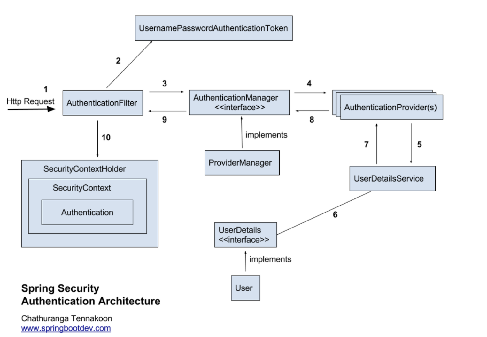

## 개요
````
스프링 시큐리티 (OAuth2) 설정 할때마다 매번 헷갈리고 이해 하고자 만든 샘플 프로젝트이다. 
````

## 구현 내용
````
Spring Security 와 jwt(jjwt)를 활용
    1). 회원가입 및 일반로그인
    - 커스텀한 로그인 구현체 EmailPasswordAuthFilter.class 로 json 형식으로 로그인 값을 받아 처리한다.
    - 패스워드 암호화는 Scrypt 알고리즘을 사용하여 구현했다.
    
    2). OAuth2 로그인 ( github, google, kakao )
    - 해당 호스팅에서 인증 후 검증을 통해 회원가입 및 로그인 구현했다.
    
    3) JWT
    - 로그인이 성공되면 AccessToken 과 RefreshToken을 생성하여 클라이언트에 AccessToken을 Response
    - Radis-Data 로 RefreshToken을 저장하며, filter를 통해 AccessToken이 만료되면 RefreshToken을 검증하여 AccessToken 재발급 
    -> AccessToken의 유효기간을 짧게, RefreshToken은 길게 가져간다. AccessToken을 자주 발급 시켜 보안적으로 안전
    -> api 요청시 Header { Authorization : `Bearer ${AccessToken}` } 형식으로 검증
    
    4) Radis 서버
    - local window
    - https://github.com/MicrosoftArchive/redis/releases
````

## 이슈 내용
````
#1 @AuthenticationPrincipal
1. 발단
- 로그인 후 로그아웃 요청 시 @AuthenticationPrincipal 객체가 null이 발생하는 문제
2. 원인
- 인증된 사용자 정보가 PrincipalDetail이 아니라 Spring Security의 기본 User 객체로 반환되고 있었다.
3. 해결
- 인증 정보를 세팅 해주는 부분 에서 PrincipalDetail이 객체로 저장 되게 바꾸었다.
-   
````

## Spring Security Architecture


## 흐름을 적어보았다.
````    
1. HTTP Request 수신

-> 사용자가 로그인 정보와 함께 인증 요청을 한다.

2. 유저 자격을 기반으로 인증토큰 생성 

-> AuthenticationFilter가 요청을 가로채고, 가로챈 정보를 통해 UsernamePasswordAuthenticationToken의 인증용 객체를 생성한다.

3. FIlter를 통해 AuthenticationToken을 AuthenticationManager로 위임

-> AuthenticationManager의 구현체인 ProviderManager에게 생성한 UsernamePasswordToken 객체를 전달한다.

4. AuthenticationProvider의 목록으로 인증을 시도

-> AutenticationManger는 등록된 AuthenticationProvider들을 조회하며 인증을 요구한다.

5. UserDetailsService의 요구

-> 실제 데이터베이스에서 사용자 인증정보를 가져오는 UserDetailsService에 사용자 정보를 넘겨준다.

6. UserDetails를 이용해 User객체에 대한 정보 탐색

-> 넘겨받은 사용자 정보를 통해 데이터베이스에서 찾아낸 사용자 정보인 UserDetails 객체를 만든다.

7. User 객체의 정보들을 UserDetails가 UserDetailsService(LoginService)로 전달

-> AuthenticaitonProvider들은 UserDetails를 넘겨받고 사용자 정보를 비교한다.

8. 인증 객체 or AuthenticationException

-> 인증이 완료가되면 권한 등의 사용자 정보를 담은 Authentication 객체를 반환한다.

9. 인증 끝

-> 다시 최초의 AuthenticationFilter에 Authentication 객체가 반환된다.

10. SecurityContext에 인증 객체를 설정

-> Authentication 객체를 Security Context에 저장한다.

최종적으로는 SecurityContextHolder는 세션 영역에 있는 SecurityContext에 Authentication 객체를 저장한다. 사용자 정보를 저장한다는 것은 스프링 시큐리티가 전통적인 세선-쿠키 기반의 인증 방식을 사용한다는 것을 의미한다.
````

## OAuth2 login 흐름

